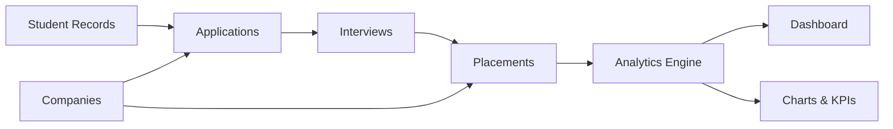
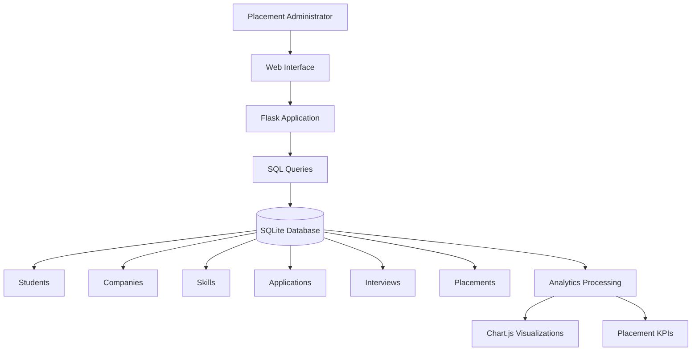

<div align="center">

# 🎓 Student Placement Analytics Platform

### A data-driven web application for managing, monitoring and analyzing student placement activities.

<p>
  
  
  
  
  
</p>

**Advances in Computing (ADC) Project · CCSDS0302 · Quality Education**

</div>

---

## 📌 Project at a Glance

The **Student Placement Analytics Platform** is a Flask-based web application that brings student placement information into one centralized system.

It manages the recruitment journey from:

**Student → Application → Interview → Placement**

and converts the stored data into useful KPIs, charts and placement analytics for the placement administration.

### 📊 Current Demonstration Dataset

| Metric | Value |
|---|---:|
| 👨‍🎓 Students | **300** |
| 🏢 Companies | **20** |
| 🛠️ Skills | **15** |
| 📝 Applications | **1,041** |
| 🎯 Interviews | **687** |
| 💼 Placements | **76** |
| 📈 Placement Rate | **25.33%** |
| 💰 Average Package | **₹8.11 LPA** |
| 🚀 Highest Package | **₹24.6 LPA** |

> The values above come from the project's seeded demonstration dataset and can be recreated using `seed_data.py`.

---

## 🎯 Problem Statement

Placement information is often maintained across multiple records, spreadsheets or disconnected systems. This makes it difficult to obtain a quick and consolidated view of:

- student placement status
- company participation
- application progress
- interview outcomes
- branch-wise placement performance
- package statistics
- overall recruitment progress

This project addresses that problem by providing a **single web-based platform** for placement record management and analytics.

---

## 💡 Proposed Solution

The platform combines:

- **Relational data management** using SQLite
- **Backend processing** using Python and Flask
- **Interactive web pages** using HTML, CSS and JavaScript
- **Data visualization** using Chart.js
- **Analytics queries** to calculate placement KPIs and recruitment insights

The result is an administrative dashboard that allows placement data to be explored instead of simply stored.

---

## ✨ Key Features

### 📊 Dashboard
- Total students
- Total companies
- Applications
- Interviews
- Placements
- Placement rate
- Average package
- Highest package
- Company-wise placement chart
- Branch-wise placement chart

### 👨‍🎓 Student Management
- View student records
- Search by name or roll number
- Filter by branch
- Filter by placement status

### 🏢 Company Management
- View recruiting companies
- Maintain company-related placement information

### 📝 Application Tracking
- Track student applications
- Monitor application status
- Connect applications with recruitment records

### 🎯 Interview Tracking
- Interview rounds
- Interview dates
- Interview results
- Remarks
- Application-based interview records

### 💼 Placement Management
- Student placement records
- Recruiting company
- Job role
- Package
- Placement date

### 📈 Analytics
- Branch-wise placements
- Company-wise placements
- Recruitment funnel
- Package distribution
- Interview-result analysis
- Application-status analysis
- Company package analysis

---

## 🧩 System Workflow



---

## 🏗️ System Architecture



### Architecture Layers

| Layer | Responsibility | Technology |
|---|---|---|
| Presentation | Pages, forms, tables and dashboard | HTML, CSS, JavaScript |
| Application | Routing and business logic | Python, Flask |
| Data | Relational storage and queries | SQLite, SQL |
| Visualization | Charts and analytical presentation | Chart.js |

---

## 🗃️ Database Design

The main database entities are:

```text
┌─────────────┐
│   Students  │
└──────┬──────┘
       │
       ▼
┌─────────────┐
│ Applications│
└──────┬──────┘
       │
       ▼
┌─────────────┐
│ Interviews  │
└──────┬──────┘
       │
       ▼
┌─────────────┐
│ Placements  │
└──────┬──────┘
       │
       ▼
┌─────────────┐
│  Companies  │
└─────────────┘

Skills are maintained as a separate entity for student skill information.
```

### Main Tables

| Table | Purpose |
|---|---|
| `students` | Student information and academic/placement details |
| `companies` | Recruiting company information |
| `skills` | Available student skills |
| `applications` | Student applications to companies |
| `interviews` | Interview rounds and outcomes |
| `placements` | Final placement records |

---

## 📐 Analytics & Calculations

### Placement Rate

The dashboard calculates placement rate using:

```text
Placement Rate =
(Placed Students / Total Students) × 100
```

For the current seeded dataset:

```text
(76 / 300) × 100 = 25.33%
```

### Average Package

The average package is calculated from package values associated with placement records.

### Highest Package

The highest package is obtained from the maximum package value stored in the placement records.

### Branch-wise Analysis

Placement records are grouped by student branch to visualize the number of placed students across branches.

### Company-wise Analysis

Placement records are grouped by normalized company name so that duplicate formatting does not unnecessarily create separate chart categories.

---

## 🖥️ Application Modules

```text
                    Student Placement Analytics
                               │
          ┌────────────────────┼────────────────────┐
          │                    │                    │
          ▼                    ▼                    ▼
      Students            Companies           Applications
          │                    │                    │
          └────────────────────┼────────────────────┘
                               ▼
                          Interviews
                               │
                               ▼
                          Placements
                               │
                               ▼
                           Analytics
                               │
                               ▼
                           Dashboard
```

---

## 🛠️ Technology Stack

### Backend
- **Python 3.11**
- **Flask 3.1.2**

### Frontend
- HTML5
- CSS3
- JavaScript

### Database
- SQLite

### Visualization
- Chart.js

### Development & Version Control
- Visual Studio Code
- Git
- GitHub

---

## 📁 Project Structure

```text
student-placement-analytics/
│
├── app.py
├── seed_data.py
├── requirements.txt
├── .gitignore
├── README.md
│
├── static/
│   └── style.css
│
└── templates/
    ├── dashboard.html
    ├── students.html
    ├── companies.html
    ├── applications.html
    ├── interviews.html
    ├── placements.html
    └── analytics.html
```

> `placement.db` is intentionally excluded from version control through `.gitignore`. The database is recreated/populated through `seed_data.py`.

---

## 🚀 Getting Started

### Prerequisites

Make sure the system has:

- Python 3.11 or compatible Python version
- Git
- A modern web browser

### 1. Clone the repository

```bash
git clone https://github.com/Naman-Choudhary-15/student-placement-analytics.git
cd student-placement-analytics
```

### 2. Install dependencies

```bash
pip install -r requirements.txt
```

### 3. Seed the demonstration database

```bash
python seed_data.py
```

### 4. Start the Flask server

```bash
python app.py
```

### 5. Open the application

Visit:

```text
http://127.0.0.1:5000/
```

---

## 🔗 Main Routes

| Route | Module |
|---|---|
| `/` | Dashboard |
| `/students` | Students |
| `/companies` | Companies |
| `/applications` | Applications |
| `/interviews` | Interviews |
| `/placements` | Placements |
| `/analytics` | Analytics |

---

## 🧪 Testing Checklist

The current working prototype has been tested across the major application modules:

- [x] Dashboard loads
- [x] Students page loads
- [x] Student search/filter functionality
- [x] Companies page loads
- [x] Applications page loads
- [x] Interviews page loads
- [x] Placements page loads
- [x] Analytics page loads
- [x] Branch-wise chart
- [x] Company-wise chart
- [x] Analytics KPIs
- [x] Sidebar navigation
- [x] SQLite database integration

---

## 🔐 Data & Repository Notes

The project uses generated demonstration data for academic development and presentation.

The local SQLite database file is excluded from Git using:

```gitignore
placement.db
```

This keeps the repository lightweight and allows the database to be recreated through:

```bash
python seed_data.py
```

---

## 🌱 Future Scope

The current project can be extended with:

- 🔐 Role-based authentication
- 👨‍💼 Placement officer and recruiter accounts
- 📥 CSV/Excel import and export
- 📄 Automated placement reports
- 📊 Advanced predictive analytics
- 👨‍🎓 Student-specific dashboards
- 🔔 Notifications and alerts
- ☁️ Cloud deployment
- 🏫 Integration with institutional ERP systems

---

## 🎓 Academic Context

This project was developed as part of the **Advances in Computing (ADC)** coursework.

**Course Code:** `CCSDS0302`

**Domain:** Quality Education

**SDG Alignment:** **SDG 4 – Quality Education**

The project demonstrates the practical integration of:

- Web application development
- Python programming
- Flask backend development
- Relational database management
- SQL querying
- Data processing
- Data visualization
- Placement analytics

---

## 👥 Project Information

**Project:** Student Placement Analytics Platform  
**Course:** Advances in Computing (ADC)  
**Course Code:** CCSDS0302  
**Project Status:** Working Prototype  
**Repository:** [GitHub](https://github.com/Naman-Choudhary-15/student-placement-analytics)

---

## 📄 License

This project was created for **academic and educational purposes**.

---

<div align="center">

### ⭐ Student Placement Analytics Platform

**Turning placement records into meaningful insights.**

</div>
